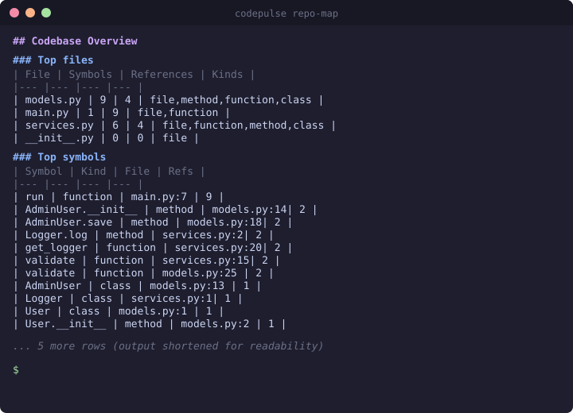
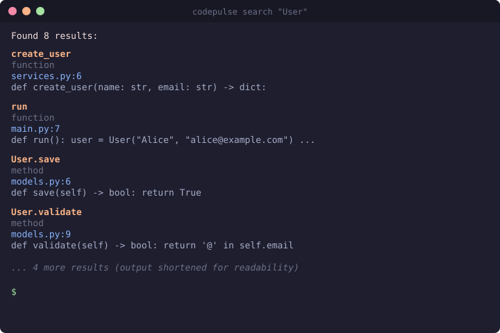
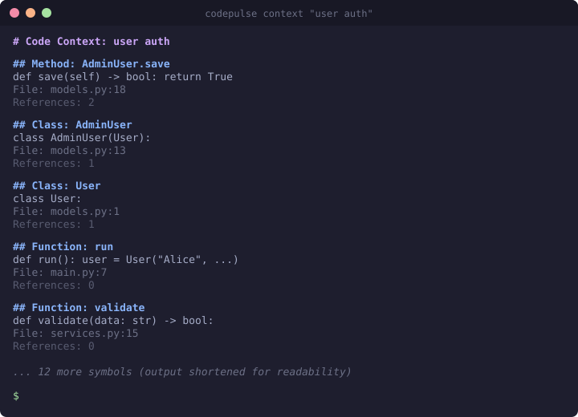

# CodePulse

[](https://opensource.org/licenses/MIT)
[](https://www.python.org)
[](https://www.typescriptlang.org)

**Code intelligence graph** — parse, query, and explore codebases through a local CLI and MCP server.

```
pip install codepulse[all]
codepulse init --path myproject
codepulse index myproject/src
codepulse search "UserService"
codepulse serve          # AI agent integration (alias: mcp)
```

---


## Why CodePulse exists

AI coding agents still inspect codebases like blind grep machines: search, open file, infer, repeat. CodePulse gives them a semantic memory layer: symbols, edges, callers, callees, impact radius, and graph queries through CLI + MCP.

Use it when you want an agent to understand a repo before editing it.

---

## What it does

CodePulse parses your codebase into a **semantic knowledge graph** stored in SQLite. Instead of grep + read + repeat, you query the graph directly:

- **Search** symbols via FTS5 full-text search
- **Trace** paths between symbols and **impact** radius
- **Map** the codebase with `repo-map` and `context` commands
- **Serve** an MCP server for AI coding agents (also: `codepulse serve`)

---

## Project status

CodePulse is an open-source project focused on code intelligence architecture. It prioritizes readability and correctness over product polish.

- **Local CLI + MCP server** — working today
- **SQLite graph + FTS5 + tree-sitter** — core and stable
- **SCIP cross-file resolution** — optional advanced path, improves accuracy
- **Embeddings** — optional advanced path, needs `sentence-transformers`
- **No web dashboard** — currently ships CLI and MCP only
- **Learning-oriented OSS** — contributions and experiments welcome

---

## CLI screenshots

Actual CLI output from a sample Python project. Output is shortened for readability.

<a href="docs/assets/repo-map.svg"></a>

<a href="docs/assets/search.svg"></a>

<a href="docs/assets/context.svg"></a>

---

## Architecture

```
                    ┌──────────────────────┐
                    │    CLI (codepulse)    │
                    │  init · index · search │
                    │  callers · callees    │
                    │  trace · impact       │
                    │  node · file          │
                    │  repo-map · context   │
                    │  serve · validate     │
                    └──────┬───────┬───────┘
                           │       │
              ┌────────────┘       └────────────┐
              ▼                                  ▼
    ┌──────────────────┐              ┌──────────────────┐
    │   Tree-sitter    │              │  MCP Server      │
    │   Parser         │              │  (stdio)         │
    │   (12 languages) │              │ 13 AI agent tools│
    └────────┬─────────┘              └────────┬─────────┘
             │                                 │
             ▼                                 ▼
    ┌──────────────────────────────────────────────┐
    │   SQLite Graph (nodes · edges · FTS5)        │
    │   Optional: SCIP cross-file resolution       │
    │   Optional: Embeddings similarity search     │
    └──────────────────────────────────────────────┘
```

---

## Quick Start

```bash
pip install "codepulse[all]"

# Analyze any public repo from URL
codepulse analyze https://github.com/owner/repo

# Or index your local project
cd myproject
codepulse init
codepulse index .
codepulse search "UserModel"
```

### Search

```bash
codepulse search "UserService"             # FTS5 full-text search
codepulse search --kind class "User"       # Filter by symbol kind
codepulse callers "src/app.ts:handleLogin"
codepulse callees "src/app.ts:handleLogin"
codepulse trace "src/a.ts:foo" "src/b.ts:bar"  # Path between two symbols
codepulse impact "src/db.ts:connect" --depth 3  # Impact radius
codepulse node "src/app.ts:handleLogin"         # Symbol details
codepulse file "src/app.ts"                     # Symbols in a file
codepulse repo-map                              # Codebase overview
codepulse context "user auth"                   # Context for a task
codepulse validate                              # Graph stats
codepulse validate --strict                     # Exit nonzero on issues
```

### Symbol Notes

```bash
codepulse note add "src/app.py:main" "Entry point wires routes and config"
codepulse note list "src/app.py:main"
codepulse note search "routes"
```

Symbol notes are a local-first memory layer for humans and agents. Attach architecture observations, edit hypotheses, and investigation findings to symbols so the next agent call starts with context instead of rediscovery.

### AI Agent Integration (MCP)

```bash
codepulse mcp       # or: codepulse serve
```

Then configure your AI agent (OpenCode, Claude Code, Cursor):

```json
{
  "mcp": {
    "codepulse": {
      "type": "local",
      "command": ["codepulse", "mcp"]
    }
  }
}
```

The MCP server provides 13 tools: `repo_map`, `context`, `search`, `callers`, `callees`, `impact`, `trace`, `node`, `file`, `add_symbol_note`, `list_symbol_notes`, `search_symbol_notes`, `status`.


---

## Supported Languages

| Language | Status |
|---|---|
| Python | ✅ Parsed & tested |
| TypeScript / JavaScript | ✅ Parsed & tested |
| Go | ✅ Parsed & tested |
| Java | ✅ Parsed & tested |
| Rust | ✅ Parsed & tested |
| Ruby | ✅ Parsed & tested |
| PHP | ✅ Parsed & tested |
| C | ✅ Parsed & tested |
| C++ | ✅ Parsed & tested |
| Swift | ✅ Parsed & tested |
| Kotlin | ✅ Parsed & tested |
| Scala | ✅ Parsed & tested |

## Turbo Indexing

`codepulse index` now uses a **file metadata cache** to skip unchanged files on re-index. On a second run, only changed files are re-parsed — everything else is instant.

```bash
codepulse index myproject/src
# First run: indexes everything
codepulse index myproject/src
# Second run: ~0s — all files cached
```

### Cache mechanics

The cache (`indexed_files` table in SQLite) stores: `file_path`, `size`, `mtime_ns`, `content_hash` (blake2b). A file is unchanged when all three match. When a file changes, its old nodes/edges are deleted before re-indexing. **Symbol notes survive** — they are stored in a separate table and are never deleted by the indexer.

### Parallel parsing

Use `--workers N` to parse files in parallel via `ProcessPoolExecutor`. Each worker creates its own `SourceParser` (grammars loaded per-process). SQLite writes remain in the main process.

```bash
codepulse index myproject --workers 4
```

### Forcing a full reindex

```bash
codepulse index myproject --no-cache
```

### Benchmarks

```bash
codepulse bench myproject          # local path
codepulse bench --workers 4 https://github.com/owner/repo   # URL
```

Output: files/sec, symbols/sec, edges/sec, elapsed time, cache hit/skip counts.

---

## SCIP Integration (Optional)

For **type-accurate** cross-file symbol resolution:

```bash
npm install -g @sourcegraph/scip-typescript @sourcegraph/scip-python

codepulse index . --use-scip
```

SCIP resolves `h.process()` → `Helper.process` instead of bare `process`. Without SCIP, CodePulse uses tree-sitter for fast syntax-level parsing; with SCIP, it adds type-level accuracy.

---

## Embeddings (Optional)

Semantic similarity search across your codebase, via the Python API (`codepulse.embeddings.index_embeddings` + `GraphDB.search_similar`). No CLI command ships for this; the codegen surface is library-only.

```bash
pip install sentence-transformers
```

---

## File Structure

```
codepulse/
├── src/codepulse/        # Python core (parser, graph, MCP, CLI)
│   ├── parser.py         # Tree-sitter AST walker (12 languages)
│   ├── db.py             # SQLite graph storage + FTS5
│   ├── graph.py          # Index, search, callers/callees
│   ├── cli.py            # Click CLI commands
│   ├── mcp_server.py     # MCP protocol (13 tools)
│   ├── compat/scip.py    # SCIP → SQLite converter
│   ├── embeddings.py     # Semantic similarity search
│   ├── config.py         # Config + env vars
│   └── parsers/           # Per-language YAML query configs
├── packages/cli/         # TypeScript CLI (npm)
├── tests/                # Python test suite
│   ├── test_accuracy.py  # Golden file tests
│   ├── test_languages.py # 17 multi-language tests
│   ├── test_scip.py      # SCIP resolution accuracy
│   ├── test_smoke.py     # Real-repo regression tests
│   └── test_turbo.py     # Turbo indexer cache + parallel tests
└── scripts/benchmark/    # A/B benchmark system
```

---

## Current limitations

- **File-path-based node IDs** — Node identifiers embed source paths, making them verbose and repo-location-dependent
- **Cross-file resolution** — Best-effort without SCIP; may produce `unresolved_symbol` noise
- **`impact` command noise** — Can include unresolved or external-symbol references
- **Embeddings require extra deps** — `embed` / `similar` need `sentence-transformers` installed separately
- **No local web UI** — No web dashboard ships with the project today
- **CLI UX** — Intentionally minimal; JSON output and TUI are future improvements

---

## Development

```bash
git clone https://github.com/codepulse/codepulse.git
cd codepulse
python3 -m venv .venv
source .venv/bin/activate
pip install -e ".[all]"
pip install pytest pytest-asyncio pytest-click
python3 -m pytest tests/
```

---

## License

MIT

---

*Built with tree-sitter, SQLite, and a lot of curiosity.*
